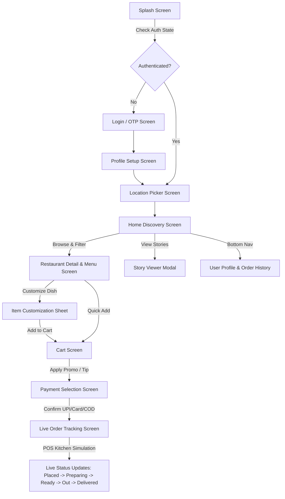

# LiveRestro — Next-Gen POS Integrated Food Delivery Application
## Comprehensive Technical Documentation & Architecture Manual

---

## 1. Executive Summary & Project Overview

**LiveRestro** is a food delivery mobile application (similar in workflow and experience to platforms like Zomato and Swiggy) developed with **Flutter** for cross-platform deployment (Android, iOS, Web, Desktop). 

The primary differentiator of LiveRestro is its **Direct Point-of-Sale (POS) Integrated Architecture**, which enables real-time synchronization between the restaurant kitchen's POS terminal and the customer app. This provides live kitchen status, preparation telemetry, and milestone-based countdown tracking without relying on manual delivery boy updates.

### Key Highlights
- **Framework & SDK:** Flutter SDK `^3.12.2` (Dart SDK 3.x)
- **State Management:** Riverpod (`flutter_riverpod: ^2.5.1`)
- **Navigation & Routing:** Declarative routing via `go_router: ^17.5.0`
- **Design Language:** *Electric Flame & Mango Chili* Theme, Plus Jakarta Sans typography, Hugeicons Stroke Rounded vector icon system.
- **Mapping & Geolocation:** OpenStreetMap (`flutter_map` / `latlong2`) & Google Maps integration (`google_maps_flutter`).
- **Core Unique Feature:** POS Kitchen Simulation & Live Stage Tracking (`Placed` $\rightarrow$ `Preparing` $\rightarrow$ `Ready` $\rightarrow$ `Out for Delivery` $\rightarrow$ `Delivered`).

---

## 2. Technical Stack & Dependencies

| Category | Technology / Package | Version | Purpose |
|---|---|---|---|
| **Core Framework** | Flutter SDK | `>=3.12.2` | Cross-platform UI toolkit |
| **Language** | Dart | `>=3.0.0` | Object-oriented typed language |
| **State Management** | `flutter_riverpod` | `^2.5.1` | Reactive, compile-safe dependency injection and state management |
| **Navigation** | `go_router` | `^17.5.0` | URL-based deep linking & declarative app routing |
| **Typography** | `google_fonts` | `^6.2.1` | Dynamic typography loading (Plus Jakarta Sans) |
| **Iconography** | `hugeicons` | `^1.1.7` | Uniform stroke-rounded icons (strictly zero emojis) |
| **Image Caching** | `cached_network_image` | `^3.3.1` | Image optimization, caching & placeholder handling |
| **UI Shimmer & Effects** | `shimmer` | `^3.0.0` | Content-placeholder skeleton loading animations |
| **Local Storage** | `shared_preferences` | `^2.2.3` | Local key-value persistence (user session, theme, recent addresses) |
| **Mapping Engine** | `flutter_map` + `latlong2` | `^7.0.2` | Open-source map tile rendering and coordinate math |
| **Map SDK** | `google_maps_flutter` | `^2.18.0` | Google Maps native view integration |
| **Utilities** | `intl`, `uuid`, `url_launcher` | `^0.19.0`, `^4.4.0`, `^6.3.2` | Currency formatting, UUID generation, rider dialer & external URLs |

---

## 3. Architecture & Directory Layout

The project follows **Feature-First Clean Architecture**, separating business logic (`providers`), domain entities (`models`), and presentation layer (`screens`, `widgets`), alongside shared foundational primitives (`core/`).

```
lib/
├── main.dart                               # Entry point, ProviderScope initialization & theme binding
├── core/
│   ├── constants/
│   │   ├── app_assets.dart                 # Image & asset path definitions
│   │   ├── app_colors.dart                 # Color palette & theme definitions (Flame, Mango, etc.)
│   │   ├── app_icons.dart                  # Centralized Hugeicons stroke-rounded mappings
│   │   ├── app_spacing.dart                # Design system layout paddings, gaps, radius
│   │   └── app_typography.dart             # Plus Jakarta Sans text styles hierarchy
│   ├── router/
│   │   └── app_router.dart                 # Declarative GoRouter route definitions & parameters
│   ├── theme/
│   │   ├── app_theme.dart                  # Light and Dark theme data configuration
│   │   └── theme_provider.dart             # Riverpod StateNotifier for theme toggling
│   ├── utils/
│   │   └── currency_formatter.dart         # Indian Rupee (₹) and price formatting helpers
│   └── widgets/                            # Reusable Design System Components
│       ├── animated_dot.dart               # Pulsing status dot indicator
│       ├── coupon_drawer.dart              # Interactive discount promo bottom sheet
│       ├── cuisine_pill.dart               # Filter chip with animated selection states
│       ├── diet_icon.dart                  # Standard Veg (Green) / Non-Veg (Red) badge
│       ├── eta_ring_timer.dart             # Circular sweep countdown timer widget
│       ├── floating_cart_bar.dart          # Bottom animated bar showing cart total & checkout CTA
│       ├── floating_nav_bar.dart           # Glassmorphic floating pill bottom navigation
│       ├── gradient_button.dart            # Standard animated gradient action button
│       ├── offer_banner_card.dart          # Featured promo carousels and discount banners
│       ├── pos_live_indicator.dart         # POS synchronization badge for restaurants
│       ├── qty_controller.dart             # Animated ADD to [- QTY +] quantity stepper
│       ├── skeleton_card.dart              # Shimmer loading skeleton placeholders
│       ├── step_indicator.dart             # Multi-stage vertical tracking timeline
│       ├── story_bubble.dart               # Instagram-style gradient-bordered story bubbles
│       └── story_viewer.dart               # Full-screen auto-advancing story viewer modal
└── features/
    ├── auth/                               # Authentication & Onboarding
    │   ├── models/user_profile.dart
    │   ├── providers/auth_provider.dart
    │   └── screens/
    │       ├── splash_screen.dart
    │       ├── login_screen.dart
    │       └── profile_setup_screen.dart
    ├── location/                           # Geolocation & Delivery Address
    │   ├── models/address_model.dart
    │   ├── providers/location_provider.dart
    │   └── screens/location_picker_screen.dart
    ├── restaurant/                         # Restaurant Discovery & Menu Browsing
    │   ├── data/mock_restaurants.dart
    │   ├── models/
    │   │   ├── restaurant_model.dart
    │   │   └── menu_item_model.dart
    │   ├── providers/restaurant_provider.dart
    │   └── screens/
    │       ├── home_discovery_screen.dart
    │       ├── restaurant_detail_screen.dart
    │       └── widgets/
    │           ├── restaurant_card.dart
    │           ├── menu_item_card.dart
    │           └── item_customization_sheet.dart
    ├── cart/                               # Cart & Basket Management
    │   ├── models/cart_item_model.dart
    │   ├── providers/cart_provider.dart
    │   └── screens/cart_screen.dart
    ├── checkout/                           # Payment Selection & Processing
    │   ├── providers/payment_provider.dart
    │   └── screens/payment_selection_screen.dart
    ├── order_tracking/                     # Live POS Tracking & Milestone Updates
    │   ├── models/order_model.dart
    │   ├── providers/order_tracking_provider.dart
    │   └── screens/live_order_tracking_screen.dart
    └── profile/                            # User Profile & Order History
        └── screens/profile_screen.dart
```

---

## 4. Design System & Theme Specifications

### 4.1 Color Palette
The visual identity is based on the **"Electric Flame & Mango Chili"** palette:

```
Primary Flame (#FF4500)   ──> Primary actions, prices, active tabs, brand accents
Flame Dark    (#CC2D00)   ──> Gradient start vectors, pressed states
Mango Gold    (#FF9500)   ──> Gradient terminations, highlight accents, star ratings
Flame Tint    (#FFF3EE)   ──> Soft card backgrounds, input fill highlights
Flame Border  (#FFD9C8)   ──> Subtle borders and dividers
Background    (#FFF8F5)   ──> Cream app surface (Light Mode) / Deep Charcoal (Dark Mode)
Card Surface  (#FFFFFF)   ──> Elevated containers and modals
Veg Green     (#16A34A)   ──> Pure Vegetarian dietary badges & active indicators
Non-Veg Red   (#DC2626)   ──> Non-Vegetarian dietary badges & error states
POS Live Dot  (#4AFF91)   ──> High-visibility pulsing neon green dot for live kitchen sync
```

### 4.2 Typography & Iconography Rules
- **Font Family:** `GoogleFonts.plusJakartaSans`
- **Font Weights:** Regular (400) for body copy, SemiBold (600) for item titles, Bold (700) for section headings, ExtraBold (800) for hero titles and prices.
- **Icon Rules:** Exclusively `HugeIcons` (Stroke Rounded variant). Strictly **no raw emojis** in UI to maintain enterprise-grade design consistency.

---

## 5. Application Modules & User Flow



### 5.1 Authentication & Onboarding Flow
1. **`SplashScreen`**: Displays glowing brand mark with smooth elastic scaling animation, checks cached user sessions via `authProvider`.
2. **`LoginScreen`**: Mobile number entry with automatic 6-digit OTP verification simulation.
3. **`ProfileSetupScreen`**: Captures user name, email, dietary preference (Veg / All), and avatar selection.
4. **`LocationPickerScreen`**: Interactive location detector, map pin centering, recent saved address selection (Home, Work, Other).

### 5.2 Discovery & Restaurant Browsing (`HomeDiscoveryScreen`)
- **Header:** Live address selector with quick switcher drawer, search bar with debounce filter, and instant Dark/Light mode toggle.
- **Story Strip:** Story bubbles with gradient rings highlighting chef specials, discounts, and regional food stories.
- **Cuisine Filters:** Horizontal pill selector (Gujarati, Kathiyawadi, Punjabi, Burgers, Pizzas, South Indian).
- **Offer Carousels:** Dynamic banners displaying coupons and time-limited deals.
- **Restaurant Feed:** Cards showing rating, distance, delivery time, price for two, cuisines, and **POS Live** connectivity badge.

### 5.3 Menu & Customization (`RestaurantDetailScreen`)
- Collapsible sliver app bar with hero imagery and restaurant meta statistics.
- Category tabs (e.g., *Special Thalis*, *Punjabi Gravies*, *Breads & Bhakhri*).
- **`ItemCustomizationSheet`**: Handles radio selections (Patty size, Crust type) and multi-select checkboxes (Add-ons like extra cheese, extra butter) with real-time price recalculation.
- **`FloatingCartBar`**: Slides up smoothly from bottom whenever items $>0$, indicating total item count, price, and instant checkout CTA.

### 5.4 Cart & Checkout Flow (`CartScreen` & `PaymentSelectionScreen`)
- Multi-restaurant cart conflict management (prompts user when switching restaurants).
- **Bill Breakdown Calculation:**
  $$\text{Final Amount} = \text{Item Total} + \text{Delivery Fee} + \text{Platform Fee} + \text{Taxes (5\% GST)} + \text{Delivery Tip} - \text{Discount}$$
- **Coupon System (`CouponDrawer`):** Validates minimum cart value and computes percentage discounts with maximum discount caps (e.g., `WELCOME100`, `LIVERESTRO50`, `FREESHIP`).
- **Payment Gateways Simulation:** UPI (Google Pay, PhonePe, Paytm, BHIM), Credit/Debit Cards, Net Banking, and Cash on Delivery (COD).

### 5.5 POS Kitchen Sync & Live Tracking (`LiveOrderTrackingScreen`)
- **Real-Time Simulation Engine:** `OrderTrackingNotifier` orchestrates automatic status transitions using a reactive `Timer`:
  1. `OrderStatus.placed`: Sent to POS terminal ($ETA \approx 25 \text{ min}$).
  2. `OrderStatus.preparing`: Chef accepted on KDS (Kitchen Display System) ($ETA \approx 20 \text{ min}$).
  3. `OrderStatus.ready`: Food packed & waiting for pickup ($ETA \approx 14 \text{ min}$).
  4. `OrderStatus.outForDelivery`: Rider in transit ($ETA \approx 8 \text{ min}$).
  5. `OrderStatus.delivered`: Order completed ($ETA = 0 \text{ min}$).
- **`ETARingTimer`:** Custom painted arc showing real-time countdown progress.
- **Milestone Timeline:** Interactive vertical step tracker with completion checkmarks and pulsing active halos.
- **Rider Contact Card:** In-app one-touch tel-dialer integration (`url_launcher`).

---

## 6. State Management Architecture (Riverpod)

The application utilizes Riverpod `StateNotifierProvider` and `Provider` constructs for immutable state management:

```
[AuthProvider] ───────────► User session, tokens, login state, profile info
[LocationProvider] ───────► Selected delivery address, saved address list
[RestaurantProvider] ─────► Restaurant list, active cuisine filter, search query
[CartProvider] ───────────► Basket items, quantities, promo code, tips, bill breakdown
[PaymentProvider] ────────► Selected payment method, transaction status
[OrderTrackingProvider] ──► Active orders list, POS lifecycle ticker, order histories
[ThemeProvider] ──────────► Brightness mode (Light vs. Dark)
```

---

## 7. Data Models Specifications

### `RestaurantModel`
```dart
class RestaurantModel {
  final String id;
  final String name;
  final String tagline;
  final double rating;
  final int ratingCount;
  final int deliveryTimeMinutes;
  final double distanceKm;
  final int priceForTwo;
  final List<String> cuisines;
  final String imageUrl;
  final String coverUrl;
  final bool isPureVeg;
  final bool isPosConnected;
  final String? offerTag;
  final List<String> categories;
  final List<MenuItemModel> menuItems;
}
```

### `MenuItemModel` & `MenuItemCustomization`
```dart
class MenuItemModel {
  final String id;
  final String restaurantId;
  final String name;
  final String description;
  final double price;
  final String imageUrl;
  final bool isVeg;
  final bool isBestseller;
  final double rating;
  final String category;
  final List<MenuItemCustomization> customizations;
}

class MenuItemCustomization {
  final String title;
  final List<CustomizationOption> options;
}
```

### `OrderModel`
```dart
enum OrderStatus { placed, preparing, ready, outForDelivery, delivered }

class OrderModel {
  final String orderId;
  final String restaurantId;
  final String restaurantName;
  final List<CartItemModel> items;
  final double billAmount;
  final AddressModel deliveryAddress;
  final String paymentMethod;
  final DateTime placedAt;
  final OrderStatus status;
  final int etaMinutes;
  final String customerName;
  final String customerPhone;
}
```

---

## 8. Build, Run & Deployment Instructions

### Prerequisites
- Flutter SDK `3.12.2` or newer
- Android Studio / VS Code with Dart & Flutter extensions
- Android SDK (API Level 21+) / Xcode (iOS 12+)

### Development Setup
```bash
# 1. Clone repository & navigate to project directory
cd "LiveRestro Application"

# 2. Fetch dependencies
flutter pub get

# 3. Verify Flutter setup
flutter doctor

# 4. Run application on connected device / emulator
flutter run
```

### Building Release Artifacts
```bash
# Generate Release Android APK
flutter build apk --release

# Generate Android App Bundle (Google Play Store)
flutter build appbundle --release

# Generate iOS IPA
flutter build ipa --release
```

---

## 9. Future Roadmap & Scalability
1. **Live WebSockets / Firebase Firestore:** Replace mock timer with bidirectional WebSocket channel connected to physical POS terminals.
2. **Payment Gateway SDKs:** Integrate native Razorpay / Stripe SDKs for automated merchant payouts.
3. **Turn-by-Turn GPS Rider Tracking:** Real-time rider coordinate publishing via Google Maps Directions API & Geolocation background services.
4. **Push Notifications:** Firebase Cloud Messaging (FCM) integration for background POS order status triggers.

---
*Documentation compiled for LiveRestro App Architecture & Technical Review.*
